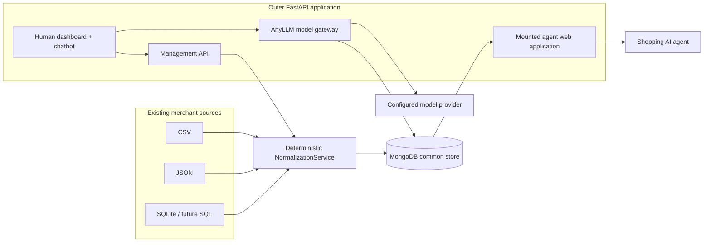

# CommerceOS — Vision-to-Implementation Plan

> Status: implementation blueprint  
> Created: 2026-08-29  
> Source of truth: [`MyVision.md`](MyVision.md)  
> Rule: this document must be created before product code is restructured or written.

## 1. Executive overview

CommerceOS will be a plug-in agentic layer for existing commerce systems. A merchant connects an existing CSV, JSON document, SQLite database, or later a platform adapter. CommerceOS deterministically ingests that source, retains every available field and relationship, stores it in a shared document model, and publishes a machine-first website that an AI agent can browse directly over HTTP.

The product is deliberately **not** an MCP tool collection wrapped around a store. The canonical interaction model is a website metaphor:

```text
agent enters store
    → reads store home page
    → follows catalog/resource links
    → searches or filters
    → opens a product/record page
    → follows related records and policies
    → sees only the actions currently available from that page
```

The built-in shopping assistant must use that same path. It may not bypass the agent
website by querying `CatalogService` and placing retrieved rows directly in a prompt. Its
runtime starts from the store home page, gives the current JSON page to the model, validates
one structured `follow`, `submit`, or `answer` decision, executes only a transition advertised
by that page, and repeats until the model answers or reaches the configured step limit.

The same outer FastAPI application also serves a polished human control plane containing merchant onboarding, synchronization health, source/schema inspection, field-mapping readiness, an agent-page inspector, and a catalog-grounded chat interface.

The implementation will use two deliberately separate data tiers:

1. **Lossless normalized source tier** — deterministic, schema-agnostic, and immediately available for every supported input. It preserves every field, row, nested value, table, primary key, foreign key, and source identity that can be recovered.
2. **Commerce projection tier** — deterministic UCP-compatible product semantics created from mature platform adapters or explicit merchant-approved mappings. It never replaces or mutates the lossless tier.

This separation is essential. An arbitrary column named `x7` cannot be proven to mean `price` without metadata, configuration, or inference. Inventing that meaning would violate the no-slop/no-generative-normalization rule. Dropping the column would violate fidelity. The two-tier design preserves both requirements honestly.

## 2. Vision traceability and non-negotiable interpretation

| Vision requirement | Implementation commitment | Verification evidence |
|---|---|---|
| Plug into any e-commerce shop | Adapter-shaped source contract; first release supports CSV, JSON, and SQLite, with a stable extension seam for platform/remote adapters | One shared normalization test suite runs against all three formats |
| Do not make a conventional MCP tool list the product | Canonical surface is linked HTTP agent pages; MCP may be added later only as an adapter over the same resources | No MCP dependency or tool registry in the core runtime |
| Do not require screenshots, selectors, or coordinates | All agent content, navigation, schemas, and available actions are structured JSON | Agent API tests traverse without rendering HTML |
| Avoid requiring every store to implement a perfect custom API | CommerceOS reads the merchant's existing source and supplies the agent-facing layer | Existing fixtures work without changing their schemas |
| Build a “website for AI agents” | A nested FastAPI agent web application returns linked machine pages with stable media types | Home → resource → record traversal test |
| Serve an AI-friendly format instead of HTML | JSON is the first canonical representation, using standard hypermedia controls and UCP commerce objects | Content-type and response-shape tests |
| Normalize arbitrary real-world data | Every source becomes a common envelope while retaining original keys and values | Deep source-vs-normalized equality tests |
| Prefer document-shaped storage | MongoDB stores vendor, resource, record, and sync documents; one record per source row/item avoids giant monoliths | Repository/index and integration tests |
| Never lose useful arbitrary fields | `data` always contains the full source record; projections are additive | Regression test for nested, nullable, unusual, and extra fields |
| Do not use generative AI for parsing/mapping | Normalization and mapping suggestions are deterministic only | Model layer is never imported by normalization tests |
| One normalization class/file | `NormalizationService` owns inventory, extraction, normalization, and safe publication orchestration | Focused unit tests for that class |
| AI web layer is its own folder and inner server | `agent_web/` contains the nested FastAPI application and page builders | Mounted-subapplication route tests |
| Human UI contains a proper chatbot and dashboard | One cohesive responsive application replaces the three duplicated prototype pages | API-backed onboarding, sync, explorer, chat, and inspector flows |
| Model layer uses any-llm | Thin `ModelGateway` wrapper uses Mozilla AI's `any-llm`; API keys remain server-side | Mocked provider test plus no-key fallback test |
| AI actually browses the machine website | A bounded LangGraph loop reads one live agent page at a time, chooses an advertised transition, executes it through the mounted ASGI application, and returns an evidence-backed answer | End-to-end home → search → product → answer test with a scripted model |
| Model output simulates UI interaction | AnyLLM returns a Pydantic-validated `follow`, `submit`, or `answer` decision; the executor rejects controls not present on the current page | Invalid-link/action and invalid-input tests |
| Library-driven development | Each concern has a researched mature dependency/standard and a documented reason below | Dependency list and research ledger |
| Never reinvent the wheel | Use UCP, RFC link/problem standards, JSON Schema, Python's mature parsers, PyMongo, Pydantic, AnyLLM, and FastAPI instead of custom protocol/parser/provider stacks | Code review against the library matrix |
| Short, concise code and few files | Four clear runtime layers, centralized models/settings, one UI shell, no class hierarchy | File/function budget review |
| No hardcoded runtime values | Secrets and deployment values live in `.env`; shared protocol, limits, aliases, and presentation values live in validated centralized configuration | Search-based audit plus settings tests |
| No hacks; consult official documentation | Implement only documented public APIs and add targeted tests around boundary behavior | Research links and dependency/API smoke tests |
| Explain every function | Every application-defined function receives a concise purpose/edge-case docstring or comment | Ruff/docstring-oriented review |

## 3. Product scope

### 3.1 First complete release

The first release will provide:

- merchant registration and source configuration;
- CSV, JSON, and SQLite ingestion;
- full SQLite table, primary-key, and foreign-key discovery;
- deterministic, idempotent, batched MongoDB publication;
- resource/schema summaries and sync history;
- merchant-supplied commerce field mappings plus deterministic mapping suggestions;
- generic agent-native hypermedia pages for all normalized resources;
- UCP 2026-08-25 catalog discovery, search, batch lookup, and product detail for projection-ready resources;
- a human dashboard, data explorer, sync controls, agent-page inspector, and grounded chatbot;
- AnyLLM provider/model selection through environment configuration;
- a useful no-key chatbot fallback based on deterministic catalog search;
- health/readiness endpoints, structured error handling, and automated tests;
- preservation/migration of useful existing Mongo vendor documents and fixture data.

### 3.2 Explicitly deferred

The following are not prerequisites for proving the vision and will not be faked:

- payment execution, checkout, returns, cancellations, or order mutation;
- AP2 mandates, payment credentials, wallet integrations, or PCI-sensitive data;
- full production identity/account linking;
- background job infrastructure for multi-million-record sources;
- Shopify, WooCommerce, Magento, PostgreSQL, MySQL, S3, or webhook adapters;
- embedding/vector search;
- model-driven normalization or autonomous schema mutation;
- MCP/A2A transports;
- claiming UCP capabilities that the server does not actually implement.

These are extension phases after catalog fidelity and browsing are correct.

## 4. Current repository audit

### 4.1 Reusable foundations

- FastAPI is already the outer server and matches the vision.
- MongoDB vendor configuration exists and the local server is healthy.
- The UI has a strong green visual language, responsive layouts, safe `textContent` rendering, and accessible status messaging worth retaining.
- The 10-product CSV, nested JSON, and seven-table Amazon SQLite fixture are valuable normalization tests.
- The current code is small, which should remain true after responsibilities are separated.

### 4.2 Problems that require restructuring

- No agent-facing website or nested application exists.
- No catalog browsing, search, linked pages, UCP profile, or agent actions exist.
- No chatbot or model layer exists.
- Synchronization always assumes SQLite regardless of the registered format.
- Only the first SQLite table is read; column names and every relationship are lost.
- The 500 Amazon products have 15,453 related rows that are currently discarded.
- The unused ingestion module does not import.
- A malformed vendor ID causes a server error in synchronization.
- User-controlled source paths are not limited to an approved root.
- Vendor IDs in browser storage are incorrectly presented as authentication.
- Whole catalogs are loaded into memory and written non-atomically to JSON files.
- Runtime configuration is constructed at import time and ignores process environment overrides.
- Three standalone HTML documents duplicate styles, brand values, scripts, and error logic.
- There are no automated tests or reproducible project metadata.

### 4.3 Preservation policy

- Preserve `MyVision.md` unchanged.
- Preserve source fixtures under `vendor_databases/`.
- Preserve existing Mongo vendor documents by supporting a small legacy-shape migration on read/write; do not drop collections.
- Replace the lossy local normalized JSON files with queryable Mongo records; existing generated files are not canonical data.
- Replace broken/duplicated prototype modules and pages only after the plan exists.
- Never overwrite unrelated user work or reset the working tree.

## 5. Standards and library research

All technical choices below were checked against current primary documentation on 2026-08-29.

| Concern | Selected library/standard | Why it is selected | Avoided reinvention |
|---|---|---|---|
| HTTP application | [FastAPI](https://fastapi.tiangolo.com/) | Existing framework; typed routing, dependency injection, nested applications, OpenAPI, lifespan support | Custom server/router/validation stack |
| Validation/settings | [Pydantic](https://docs.pydantic.dev/) and [pydantic-settings](https://docs.pydantic.dev/latest/concepts/pydantic_settings/) | Validated request, config, and internal boundary models with native environment loading | Hand-written environment parsing and validation |
| Agentic commerce semantics | [Universal Commerce Protocol (UCP)](https://ucp.dev/) v2026-08-25 | Current open commerce standard covering discovery, catalog search/lookup, structured actions, checkout, and extensions | A private commerce schema or flat proprietary tool list |
| UCP Python models | [Official `ucp-sdk`](https://github.com/Universal-Commerce-Protocol/python-sdk) 0.5.x | Generated Pydantic models specifically mapped to UCP 2026-08-25 | Copying or maintaining UCP JSON Schemas manually |
| Generic agent pages | [RFC 8288 Web Linking](https://www.rfc-editor.org/rfc/rfc8288.html), [JSON Schema](https://json-schema.org/specification), and a versioned JSON profile | Stable link semantics and generated input schemas; the small page envelope borrows Siren's proven entity/link/action concepts without claiming conformance to its WIP specification | An undocumented payload or proprietary global operation catalog |
| CSV parsing | Python [`csv`](https://docs.python.org/3/library/csv.html) | The mature standard parser exposes headers and positional cells, including duplicate headers and ragged rows that dictionary/dataframe coercion can lose | Hand-written delimiter/quoting logic |
| JSON parsing | Python [`json`](https://docs.python.org/3/library/json.html) with parse hooks | The mature standard parser can retain decimal precision and detect duplicate object members through hooks; original bytes remain authoritative | A custom JSON parser or silent dict overwrites |
| SQLite parsing/metadata | Python [`sqlite3`](https://docs.python.org/3/library/sqlite3.html) | Mature standard library, true read-only URIs, row factories, PRAGMA metadata, quoted identifiers, and exact SQLite behavior with no abstraction leakage | Unsafe SQL construction or “first table wins” guessing |
| Observed schema | [GenSON](https://github.com/wolverdude/GenSON) plus [`jsonschema`](https://python-jsonschema.readthedocs.io/) | Merges observed arbitrary JSON shapes into descriptive JSON Schema without pretending to infer commerce semantics | A hand-written schema inference engine |
| Document/artifact persistence | [PyMongo](https://www.mongodb.com/docs/languages/python/pymongo-driver/current/) and GridFS | Official MongoDB driver, bulk writes, indexes, stable document semantics, and managed original-source artifacts above the BSON document limit | Home-grown storage abstraction or lossy file-per-catalog outputs |
| Mapping suggestions | [RapidFuzz](https://rapidfuzz.github.io/RapidFuzz/) | Fast deterministic field-name similarity using merchant-editable aliases | Generative mapping or custom edit-distance code |
| Multi-provider models | [Mozilla AI `any-llm`](https://github.com/mozilla-ai/any-llm) | Required by the vision; unified typed interface backed by official provider SDKs | One wrapper per model vendor or a proxy dependency |
| Agent control flow | [LangGraph](https://docs.langchain.com/oss/python/langgraph/overview) | Its low-level `StateGraph`, async nodes, and conditional edges directly model the bounded read/decide/navigate loop without imposing a tool-agent abstraction | A custom state machine, recursive coroutine, or provider-specific agent framework |
| In-process website traversal | [HTTPX ASGI transport](https://www.python-httpx.org/advanced/transports/#asgi-transport) | Executes real HTTP requests against the mounted FastAPI application without loopback networking or route duplication | Calling catalog services behind the website's back or maintaining a fake page client |
| Action input validation | [`jsonschema`](https://python-jsonschema.readthedocs.io/) | Validates model-supplied inputs against the exact schema advertised on the current page | Hand-written field/type validation |
| HTTP/API tests | [pytest](https://docs.pytest.org/) and [HTTPX](https://www.python-httpx.org/) | Mature fixtures, parametrization, and ASGI transport support | Custom test runner/client |
| Mongo tests | A uniquely named real test database, with [testcontainers](https://testcontainers-python.readthedocs.io/) as portable CI follow-up | Exercises actual BSON, indexes, bulk writes, and revision behavior; the available local Mongo enables the same path now | Depending on incomplete Mongo emulation for fidelity assertions |
| Formatting/lint | [Ruff](https://docs.astral.sh/ruff/) | One fast mature tool for formatting and static lint checks | Custom style scripts or many overlapping tools |
| Dependency workflow | [uv](https://docs.astral.sh/uv/) with `pyproject.toml` and a lockfile | Installed in the environment; reproducible, concise, modern Python workflow | Manually pinning every transitive package |

### 5.1 Protocol decision

The protocol surface is intentionally layered:

1. **Profiled JSON agent pages are canonical for arbitrary data.** They provide a store home, resource collections, record pages, navigation, schemas, and currently valid actions even when a source has no commerce mapping. The profile uses RFC 8288 relations, JSON Schema action inputs, and Siren-inspired affordances without claiming normative Siren conformance.
2. **UCP is canonical for standardized commerce meaning.** A projection-ready store advertises only implemented catalog capabilities and returns SDK-validated UCP products.
3. **OpenAPI remains developer documentation, not the browsing experience.** Agents can traverse runtime links without downloading the whole API contract or guessing endpoint sequences.
4. **MCP is not the source of truth.** A later MCP resource adapter may mirror these pages, but it must not replace them with opaque tools.
5. **AP2 is deferred until payment exists.** AP2 explicitly secures payment authorization and assumes a commerce protocol; it is not a catalog normalization protocol.

## 6. System architecture



### 6.1 Runtime boundaries

#### Outer application

Owns process lifecycle, Mongo connection setup/cleanup, centralized settings, human static assets, management APIs, health/readiness, error translation, and mounting the inner agent application.

#### Normalization layer

Owns safe path resolution, source inventory, deterministic extraction, schema/relationship capture, batching, stable record identity, sync revision publication, and commerce mapping suggestions. It must never import or call AnyLLM.

#### Persistence/catalog layer

Owns Mongo queries, indexes, pagination, search, vendor/resource lookup, projections, and sync status. This is a thin repository/service boundary, not an inheritance hierarchy.

#### Agent web layer

Owns machine-first representations only. It produces profiled linked JSON pages for generic data and UCP profile/catalog responses for mapped product data. It is a nested FastAPI application so the human/API shell and agent website remain conceptually and operationally separate.

#### Model layer

Owns one reusable AnyLLM client, Pydantic-validated browser decisions, bounded page memory,
and the LangGraph agent-browser runtime. The runtime reaches catalog facts only through the
mounted agent website. It never parses source data, queries catalog persistence, or decides
schema mappings.

#### Human UI

Owns merchant workflows and visibility: setup, sync, health, resource inspection, field mapping, agent endpoint inspection, and chat. It never contains provider API keys.

## 7. Target repository structure and file budget

```text
.
├── docs/                           # Product vision, plan, status, and idea note
│   ├── 00-README.md
│   ├── IMPLEMENTATION_PLAN.md      # This blueprint and research record
│   ├── IMPLEMENTATION_STATUS.md    # Current implementation state
│   ├── MyVision.md                 # Immutable product constitution
│   └── agent_native_commerce_idea.md
├── 00-REPOSITORY-MAP.md            # Quick orientation to the repository
├── README.md                       # Concise setup, run, and usage guide
├── main.py                         # Outer app factory, lifespan, management API
├── config.py                       # Validated env + centralized YAML loader
├── models.py                       # Shared Pydantic boundary/data models
├── config/
│   └── commerce.yml                # Routes, limits, collections, aliases, UCP metadata
├── services/
│   ├── normalization_service.py    # Required deterministic normalization class
│   └── catalog_service.py          # Mongo persistence/search/projection operations
├── agent_web/
│   ├── __init__.py
│   └── app.py                      # Nested agent-page + UCP site and page builders
├── model_layer/
│   ├── __init__.py
│   └── client.py                   # Thin AnyLLM gateway
├── human_ui/
│   ├── index.html                  # Single accessible dashboard/chat shell
│   ├── app.css                     # Shared responsive visual system
│   └── app.js                      # API-backed interactions and state
├── tests/
│   ├── conftest.py
│   ├── test_normalization.py
│   ├── test_agent_web.py
│   └── test_management_api.py
├── vendor_databases/               # Existing source fixtures retained
├── pyproject.toml
├── uv.lock
├── .env.example
└── .gitignore
```

The budget is intentionally small: three root Python modules, two service modules, one agent application module, one model client, three UI assets, and four focused test files. A new file is allowed only when it creates a real layer boundary, is required by a tool, or materially reduces duplication.

## 8. Centralized configuration

### 8.1 `.env` / process environment

Environment-specific and secret values:

- `CONFIG_PATH`
- `MONGODB_URI`
- `MONGODB_DATABASE`
- `SOURCE_ROOTS`
- `APP_ENV`
- `APP_HOST`
- `APP_PORT`
- `ADMIN_API_KEY` (optional for local development, required for exposed deployments)
- `MODEL_PROVIDER`
- `MODEL_NAME`
- `MODEL_API_KEY`
- `MODEL_API_BASE`

The real `.env` stays ignored. `.env.example` contains names and safe local examples only.

### 8.2 `config/commerce.yml`

Non-secret shared values used in more than one place:

- app/brand text;
- API and agent route prefixes;
- Mongo collection names;
- supported input types and extensions;
- read batch size, page limits, source-size limits, and mapping threshold;
- UCP version, spec/schema URLs, capability names, and media types;
- agent-page profile version/schema URL and RFC link relation names;
- semantic target fields and merchant-editable aliases;
- UI navigation labels and local-storage key names if needed.

`config.py` validates both sources at startup and fails with a clear message. Application modules consume a settings object rather than reading environment variables or YAML directly.

## 9. Common data model

### 9.1 Vendor document

```json
{
  "_id": "ObjectId",
  "name": "Acme Supply",
  "slug": "acme-supply",
  "source": {
    "kind": "csv | json | sqlite",
    "path": "vendor_databases/acme/products.csv"
  },
  "mapping": {
    "resource": "products",
    "fields": {
      "id": "sku",
      "title": "product_name",
      "price": "price_in_cents"
    }
  },
  "status": "ready | syncing | needs_mapping | error",
  "created_at": "RFC3339",
  "updated_at": "RFC3339"
}
```

Legacy `type`, `location`, `format`, and `db_path` fields can be read and migrated into the nested shape without dropping the original document first.

### 9.2 Resource document

One document per source table/list/resource and sync revision:

```json
{
  "vendor_id": "ObjectId",
  "name": "products",
  "kind": "table",
  "schema": {
    "fields": [{"name": "sku", "type": "string", "required": true}],
    "primary_key": ["sku"],
    "foreign_keys": []
  },
  "record_count": 500,
  "mapping_suggestions": {},
  "sync_id": "uuid",
  "published_at": "RFC3339"
}
```

### 9.3 Normalized record document

```json
{
  "_id": "deterministic hash",
  "vendor_id": "ObjectId",
  "resource": "products",
  "source": {
    "kind": "sqlite",
    "identity": {"parent_asin": "B00..."},
    "position": 42
  },
  "data": {
    "parent_asin": "B00...",
    "title": "Exact original value",
    "every_other_field": "retained"
  },
  "relationships": [
    {
      "rel": "product_features.parent_asin",
      "target_resource": "product_features",
      "local": {"parent_asin": "B00..."}
    }
  ],
  "search_text": "deterministically generated searchable scalar text",
  "commerce": null,
  "sync_id": "uuid"
}
```

Rules:

- `data` is lossless and never overwritten by projection logic.
- `_id` is stable across identical re-syncs.
- source identity prefers declared primary keys; otherwise it uses a deterministic canonical-record hash plus position.
- nested objects/lists remain nested.
- binary values use an explicit encoded wrapper with content type rather than silent string coercion.
- unsupported or oversized values fail visibly; they are never truncated without disclosure.
- `commerce` is additive and populated only from an approved deterministic mapping.

### 9.4 Sync document

Tracks start/end time, adapter, source fingerprint, resource counts, written/updated/deleted counts, warnings, error details safe for the dashboard, and publication status. A new revision becomes visible only after every extraction batch succeeds.

### 9.5 Original source artifact

Each accepted sync records a SHA-256 digest and retains the exact input artifact in managed GridFS when it is not already an immutable managed upload. This is the fidelity escape hatch for duplicate CSV headers, duplicate JSON member names, precise lexical number forms, BLOBs, malformed rows, and future normalizer upgrades. Agent pages expose provenance and digest, never the artifact's private server path or bytes by default.

## 10. Deterministic normalization design

### 10.1 Pipeline

1. Validate the vendor ID and source configuration.
2. Resolve the path and prove it is inside one of `SOURCE_ROOTS` after symlink resolution.
3. Detect/confirm the adapter from the declared kind and actual source.
4. Fingerprint and retain the exact original source artifact.
5. Inventory all resources before writing.
6. Extract records in configured batches.
7. Convert only transport-incompatible primitives through explicit reversible encodings.
8. Capture schema, primary keys, foreign keys, and source positions.
9. Compute stable record IDs and searchable scalar text.
10. Build an observed GenSON schema and deterministic field-mapping suggestions.
11. Bulk upsert records tagged with a new `sync_id`.
12. Publish resource metadata only after extraction succeeds.
13. Remove records from older revisions only after the new revision is published.
14. Record success/failure metrics and update the vendor status.

### 10.2 CSV adapter

- Let Python's `csv` library handle dialect, quoting, newline, and cell parsing.
- Retain the original header array and positional cells so duplicate headers and ragged rows remain recoverable; generate collision-safe convenience keys only as an additive view.
- Treat one file as one named resource.
- Stream rows instead of loading the full file.
- Preserve missing-vs-empty distinctions and record malformed row warnings rather than silently skipping data.

### 10.3 JSON adapter

- Parse strict JSON with Python's `json` hooks for decimal precision and duplicate-member detection.
- A top-level list becomes one resource.
- A top-level object containing lists becomes one resource per list plus a metadata resource for remaining keys.
- A single object becomes a one-record resource.
- Nested objects and arrays stay nested; no automatic flattening.
- Preserve the original artifact digest/bytes because JSON object semantics cannot address duplicate names through a normal dictionary view.
- Reject ambiguous JSON Lines as plain JSON; add an explicit `jsonl` adapter later rather than guessing.

### 10.4 SQLite adapter

- Open the database read-only.
- Inspect every non-system table.
- Reflect column types, primary keys, foreign keys, and indexes through documented SQLite PRAGMA APIs.
- Quote identifiers with the adapter's single reviewed helper; identifiers come only from SQLite metadata, never from request input.
- Batch through all rows in deterministic primary-key order where possible.
- Emit one resource per table and relationship metadata for every foreign key.
- Preserve all seven existing Amazon tables, not only `products`.

### 10.5 Mapping/projection

- The auto-suggestion engine compares normalized field names with aliases from `commerce.yml` using RapidFuzz.
- Suggestions include scores and are shown to the merchant.
- Only unambiguous suggestions above the configured threshold may be auto-selected; the merchant can correct or clear them.
- Price mappings explicitly declare major units vs minor units. The code must never guess cents from magnitude.
- Missing required UCP fields make the resource `needs_mapping`; they do not trigger invented placeholder data.
- Projection reads from `data` and writes a separate `commerce` object.

## 11. Agent-native web design

### 11.1 Canonical profiled JSON pages

All generic agent pages use `application/json` with a versioned `profile` parameter and a `describedby` link. The compact representation contains:

- `page`: stable page ID, type, title, and summary;
- `data`: page state and full relevant content, including UCP objects when available;
- `entities`: bounded embedded summaries or linked related entities;
- `links`: `self`, `home`, `collection`, `next`, `previous`, `item`, `schema`, and UCP equivalents where applicable;
- `actions`: only actions valid on the current page, with method, href, media type, and a Pydantic-generated JSON input schema;
- `meta`: representation version, language, revision, and pagination state.

Protocol failures use RFC 9457 `application/problem+json`. UCP business outcomes remain inside UCP `messages`. Registered RFC/IANA link relations are used whenever available; owned profile relation URIs are used only for domain-specific transitions.

Planned traversal:

```text
GET /agent/{store}/
  ├── GET /agent/{store}/resources
  │     ├── GET /agent/{store}/resources/{resource}
  │     │     └── GET /agent/{store}/resources/{resource}/{record_id}
  │     └── GET /agent/{store}/search?q=...
  ├── GET /agent/{store}/schema
  └── GET /agent/{store}/.well-known/ucp
```

Pagination uses opaque cursors and configured limits. The agent never needs to infer selectors or know a route catalog in advance; every next valid transition appears in the current representation.

### 11.2 UCP 2026-08-25 catalog surface

Projection-ready stores expose and advertise only:

- catalog search;
- catalog lookup;
- product detail.

Development gateway paths:

```text
GET  /agent/{store}/.well-known/ucp
POST /agent/{store}/ucp/catalog/search
POST /agent/{store}/ucp/catalog/lookup
POST /agent/{store}/ucp/catalog/product
```

For true UCP production discovery, each merchant hostname maps its root `/.well-known/ucp` to the corresponding store profile. The path-scoped development form is a multi-tenant gateway convenience and must not be mislabeled as root-host conformance.

Every UCP response is built/validated with `ucp-sdk` 0.5.x models for specification version `2026-08-25`. Unknown product identifiers are UCP business outcomes, not incorrectly translated transport failures. Search is cursor-paginated, and prices are emitted in declared minor units with ISO currency values only when those facts exist.

### 11.3 OpenAPI and future transports

FastAPI's OpenAPI remains available for developers and tests. It is supplementary: runtime links are the agent's navigation source. A future MCP adapter should expose pages as resources/templates and reserve tools for state-changing actions. A future A2A binding should advertise the same UCP capabilities rather than create a parallel catalog model.

### 11.4 Built-in agent browser

The human-facing chat demonstrates the canonical website model rather than a parallel RAG
path:

```text
user goal
    → open store home
    → model reads current JSON page and bounded prior-page evidence
    → model returns exactly one structured decision
       ├── follow: an exact href advertised by the current page
       ├── submit: a current action ID plus schema-valid inputs
       └── answer: a grounded final response
    → executor validates the decision and performs the HTTP transition
    → repeat from the returned page
```

The executor uses HTTPX's ASGI transport against the real mounted FastAPI application. It
does not call `CatalogService`, infer routes, or accept arbitrary model-generated URLs. A
follow target must exactly match a top-level page link or entity `href`; a submitted action
must exist on the current page; its inputs must pass the action's advertised JSON Schema; and
every target must remain on the current storefront path and origin. Merchant data is always
untrusted content, never control data.

Runs are bounded by configured page-memory, history, timeout, and step limits. The response
includes the final answer, exact record-page sources discovered during browsing, and a concise
navigation trace. Without a model configuration, the same HTTP browser performs a deterministic
home → search traversal and returns exact matches; it does not restore the direct-database
chat shortcut.

## 12. Human dashboard and chatbot

### 12.1 Information architecture

One responsive application replaces registration/login/home duplication:

- **Overview** — vendor selector, readiness, record/resource totals, last sync, and agent endpoint;
- **Sources** — register/edit CSV, JSON, or SQLite source and trigger synchronization;
- **Catalog** — browse normalized resources and full raw records;
- **Mapping** — review deterministic suggestions and approve UCP fields/units;
- **Agent site** — inspect/copy the current agent home page and UCP discovery profile;
- **Chat** — ask natural-language questions grounded in the selected store;
- **Activity** — sync history, counts, warnings, and failures.

### 12.2 Visual direction

Retain the best qualities of the existing UI while consolidating it:

- warm off-white canvas, deep moss brand color, mint/lime status accents;
- strong editorial typography and restrained shadows;
- dense enough for operational data without generic admin-template chrome;
- a two-pane desktop layout and clear single-column mobile layout;
- visible focus states, semantic landmarks, labeled controls, live regions, keyboard access, and reduced-motion support;
- no decorative imagery unless it carries product meaning.

### 12.3 Chat flow

1. Validate the selected vendor and prompt.
2. Open that vendor's public agent-site home page through the in-process ASGI transport.
3. Give AnyLLM the current page, bounded previously visited page evidence, the user goal, and safe conversation history.
4. Validate and execute one advertised `follow` or `submit` decision, then repeat from the returned page.
5. Stop on a validated `answer` decision or the configured step limit.
6. Return the answer with discovered record-page references and the navigation trace.
7. If no provider/model is configured, traverse home → search deterministically and summarize exact returned entities.

Catalog text is always treated as untrusted data, never executable instruction. API keys are read server-side from the selected model configuration and never returned to the browser or stored in Mongo.

## 13. Management API

Proposed outer API surface:

```text
GET    /api/health
GET    /api/ready
GET    /api/vendors
POST   /api/vendors
GET    /api/vendors/{vendor_id}
PATCH  /api/vendors/{vendor_id}
POST   /api/vendors/{vendor_id}/sync
GET    /api/vendors/{vendor_id}/syncs
GET    /api/vendors/{vendor_id}/resources
GET    /api/vendors/{vendor_id}/records
PUT    /api/vendors/{vendor_id}/mapping
POST   /api/vendors/{vendor_id}/chat
```

The API returns typed error bodies and correct 400/404/409/422/500 distinctions. Invalid ObjectIds never escape as uncaught server errors. Long-term background execution can replace synchronous sync without changing the resource contracts.

## 14. Security and operational guardrails

- Resolve and restrict source paths to approved roots.
- Reject symlink escapes, missing files, disallowed extensions, and source files above configured limits.
- Open databases read-only and quote identifiers through libraries.
- Batch and bound record processing.
- Do not expose absolute server paths through agent pages.
- Do not treat a Mongo ObjectId as authentication.
- Keep the local operator dashboard openly accessible only in local development; require `ADMIN_API_KEY` before any exposed deployment until real identity is implemented.
- Keep agent catalog reads public only when the merchant config declares them public.
- Use Mongo indexes for slug uniqueness, vendor/resource lookups, sync revision, and text search.
- Redact secrets and internal exception details from responses.
- Render untrusted UI values with DOM text APIs rather than `innerHTML`.
- Add request-size limits and configure pagination maximums.
- Never send provider keys or unrestricted catalogs to the model.
- Never implement payment or checkout as a fake/demo write path.

## 15. Error and consistency model

- A sync creates a unique revision.
- Records from the prior revision remain queryable until the new revision has fully succeeded.
- A failed sync records its error and leaves the prior published revision untouched.
- A successful publish swaps the vendor's active revision, then prunes stale data.
- Re-running an unchanged source is idempotent and keeps deterministic record IDs.
- Partial resource warnings are explicit; silent truncation is forbidden.
- Agent pages return conventional HTTP errors for transport/resource problems.
- UCP routes follow UCP's separation between transport errors and business outcomes.

## 16. Testing strategy and acceptance criteria

### 16.1 Normalization tests

- CSV headers and every value survive normalization.
- Nested JSON objects/lists survive deep equality comparison.
- Every SQLite table is extracted.
- Primary and foreign keys are present in resource metadata.
- The Amazon fixture's related resources are not discarded.
- Null, empty string, boolean, integer, decimal-like, datetime-like, Unicode, and nested values remain distinguishable.
- Stable IDs remain stable across repeated syncs.
- A new successful revision removes stale rows only after publish.
- A failed revision leaves the previous revision active.
- Path traversal, symlink escape, invalid format, and excessive size are rejected.
- Normalization makes no model calls.

### 16.2 Agent web tests

- A client can start with only the store home URL and traverse to a record.
- Every page has `self` and appropriate parent/next links.
- Pagination has no duplicates or gaps.
- Search returns grounded matching records and record URLs.
- Raw arbitrary fields remain visible on record pages.
- UCP discovery advertises only working capabilities.
- UCP catalog responses validate through the official SDK.
- Missing mapping data is surfaced, not invented.
- Unknown identifiers follow the UCP business-outcome contract.

### 16.3 Management/model tests

- Vendor CRUD validates IDs, formats, slugs, and paths.
- Existing legacy vendor documents remain readable.
- Sync status/counts are accurate.
- No-key chat returns deterministic grounded results.
- AnyLLM chat receives bounded context and returns normalized text.
- Configured chat opens the agent home and reaches facts only through advertised page controls.
- Model decisions are Pydantic-valid and cannot follow an unadvertised or cross-store URL.
- Action submissions are rejected unless their inputs satisfy the current action's JSON Schema.
- A multi-step scripted model can search, open at least two records, and return a comparison with record-page sources.
- Step exhaustion ends with a best-evidence answer rather than an unbounded graph or raw exception.
- Provider errors become safe actionable API errors.
- Health and readiness distinguish process health from dependency readiness.

### 16.4 UI checks

- All main workflows are reachable by keyboard.
- Forms have labels and server/client errors are announced.
- Mobile and desktop CSS layouts are coherent.
- Long names, IDs, and JSON do not break the layout.
- Empty, loading, success, warning, and error states exist.
- Untrusted content never enters the DOM through raw HTML.

### 16.5 Completion gate

The first release is complete only when:

1. clean environment installation succeeds from the lockfile;
2. format, lint, and test suites pass;
3. the application starts with the example configuration;
4. a CSV, JSON, and multi-table SQLite source each synchronize losslessly;
5. an agent can traverse linked JSON pages and search without OpenAPI/MCP knowledge;
6. a mapped fixture passes UCP SDK validation for search and lookup;
7. the dashboard chat itself uses a bounded model-directed home → action → page loop and works with and without a provider key;
8. no secret, unrestricted path, fake authentication claim, or silent data loss remains.

## 17. Implementation sequence

### Phase 0 — plan and research

- [x] Read `MyVision.md` in full.
- [x] Audit the current repository and working tree without mutating existing data.
- [x] Research current mature libraries and agent-commerce standards from primary sources.
- [x] Resolve the arbitrary-schema/semantic-mapping conflict with a lossless-plus-projection design.
- [x] Create this plan before product implementation.

### Phase 1 — foundation

- [ ] Introduce `pyproject.toml`, uv lockfile, runtime/dev dependency groups, and Ruff configuration.
- [ ] Add validated centralized environment/YAML configuration.
- [ ] Consolidate Pydantic models.
- [ ] Refactor `main.py` to an app factory with lifespan-managed Mongo.
- [ ] Add safe health/readiness and Mongo indexes.
- [ ] Remove broken/obsolete modules only after their useful behavior is covered.

### Phase 2 — lossless normalization

- [ ] Implement safe adapter dispatch and source-root validation.
- [ ] Implement CSV, JSON, and all-table SQLite extraction.
- [ ] Implement stable IDs, resource schemas/relationships, batches, revisions, and bulk upserts.
- [ ] Implement deterministic mapping suggestions and explicit projection rules.
- [ ] Test against all existing fixtures, including Amazon relationship counts.

### Phase 3 — agent-native website

- [x] Create and mount the inner FastAPI agent application.
- [x] Implement profiled JSON store/resource/search/record/schema pages.
- [x] Implement opaque cursor pagination and related-record navigation.
- [x] Implement UCP profile, catalog search, lookup, and product detail using the official SDK.
- [x] Add traversal, fidelity, pagination, and UCP validation tests.

### Phase 4 — model layer and chat

- [x] Add the thin AnyLLM gateway with server-side provider configuration.
- [x] Add a LangGraph state loop for model-directed agent-page traversal.
- [x] Add Pydantic `follow`, `submit`, and `answer` decisions through AnyLLM structured output.
- [x] Execute exact advertised controls through HTTPX's in-process ASGI transport.
- [x] Remove the chat path's direct catalog retrieval and ground it in bounded visited pages.
- [x] Implement provider and no-provider browser paths.
- [x] Test multi-page decisions, citations/record links, invalid controls, step limits, and safe failures.

### Phase 5 — human control plane

- [ ] Replace three duplicated pages with one dashboard application.
- [ ] Connect vendor, sync, resources, mapping, agent inspector, activity, and chat flows.
- [ ] Preserve/refine the existing visual language and accessibility.
- [ ] Validate empty/loading/success/error states and responsive layout.

### Phase 6 — final verification and delivery

- [x] Run Ruff formatting/lint checks.
- [x] Run the complete pytest suite and a real local Mongo smoke flow.
- [x] Start the production-style server and exercise health, sync, agent traversal, UCP, and chat endpoints.
- [x] Add a concise README and configuration reference.
- [x] Review the final tree against every row in the traceability table.
- [ ] Prepare deployment packaging and publish only to a runtime that supports FastAPI plus Mongo configuration; do not replace FastAPI to fit a static host.

## 18. Evolution path after the first release

1. Add mature platform adapters (Shopify, WooCommerce, Magento) that emit explicit mappings and preserve platform-native raw payloads.
2. Move large synchronizations to a mature task queue only when measured runtime requires it.
3. Add Postgres/MySQL and remote object-store adapters through their mature drivers and fsspec-compatible libraries.
4. Add authenticated merchant accounts and UCP identity linking.
5. Add cart/checkout only when backed by real merchant actions and UCP conformance tests.
6. Add AP2 only alongside real payment processing and mandate verification.
7. Add MCP resources and A2A bindings as alternate transports over the same canonical agent pages/UCP model.
8. Evaluate embeddings only as an additive search index; never replace exact source data or deterministic filters.

## 19. Final engineering rules

- The vision and this traceability table outrank convenience.
- The lossless source document is immutable truth; projections are replaceable views.
- No generative model participates in ingestion, normalization, schema inference, IDs, prices, inventory, or field mapping.
- No field is dropped merely because CommerceOS does not understand it.
- No value is invented merely to satisfy a downstream schema.
- Use a mature library or standard whenever one owns the problem well.
- Keep wrappers thin and delete abstractions that merely rename library calls.
- Keep functions short, single-purpose, typed, and documented; split only at real boundaries.
- Put runtime variability in environment/configuration, never scattered literals.
- Prefer a clear failure over a silent fallback, lossy conversion, or hack.
- Advertise only behaviors that are implemented and verified.
- Preserve the user's existing data and unrelated working-tree changes.
